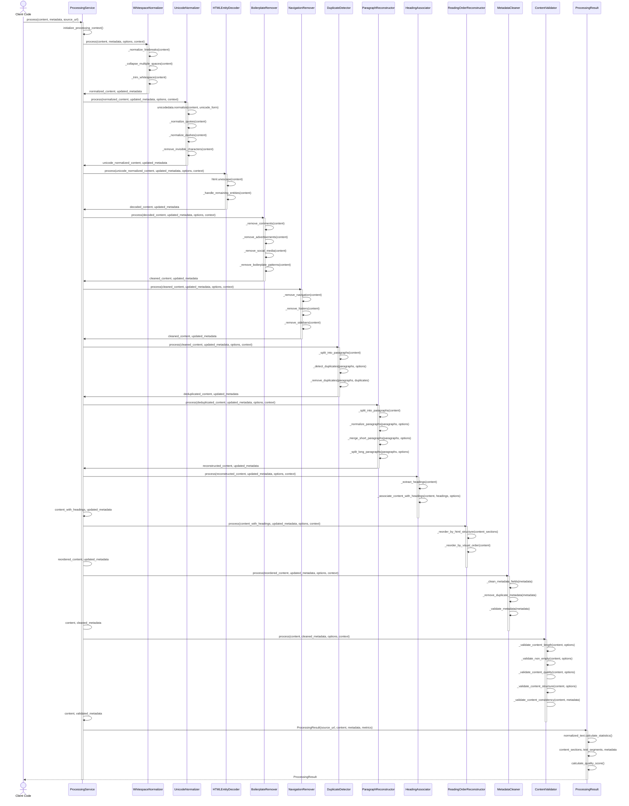
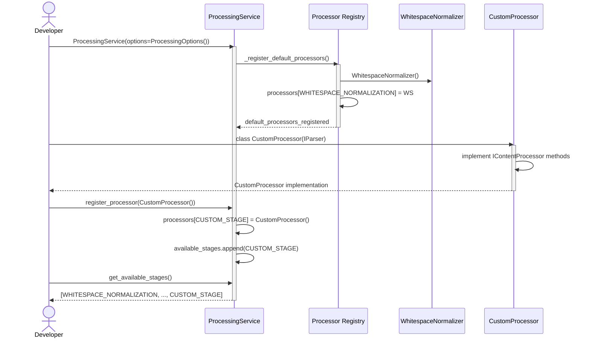
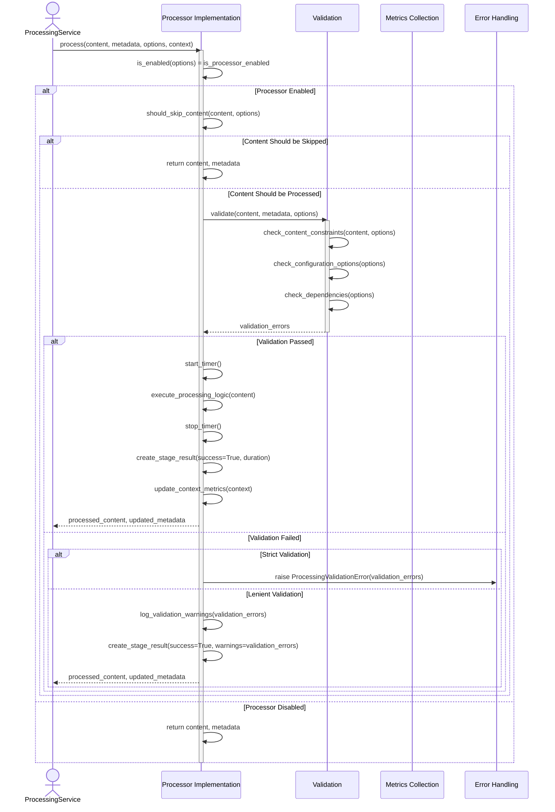
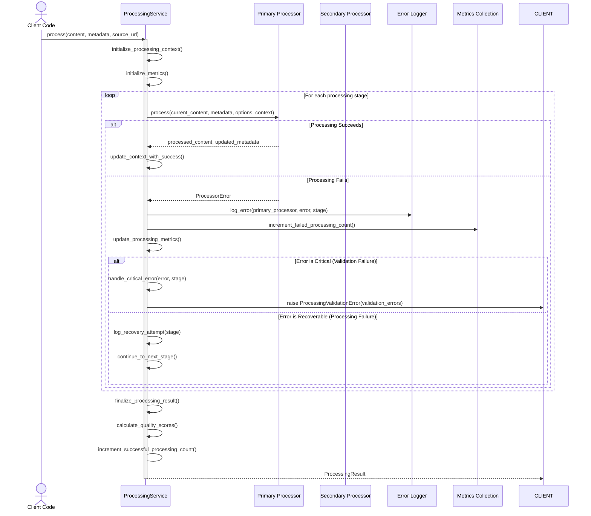
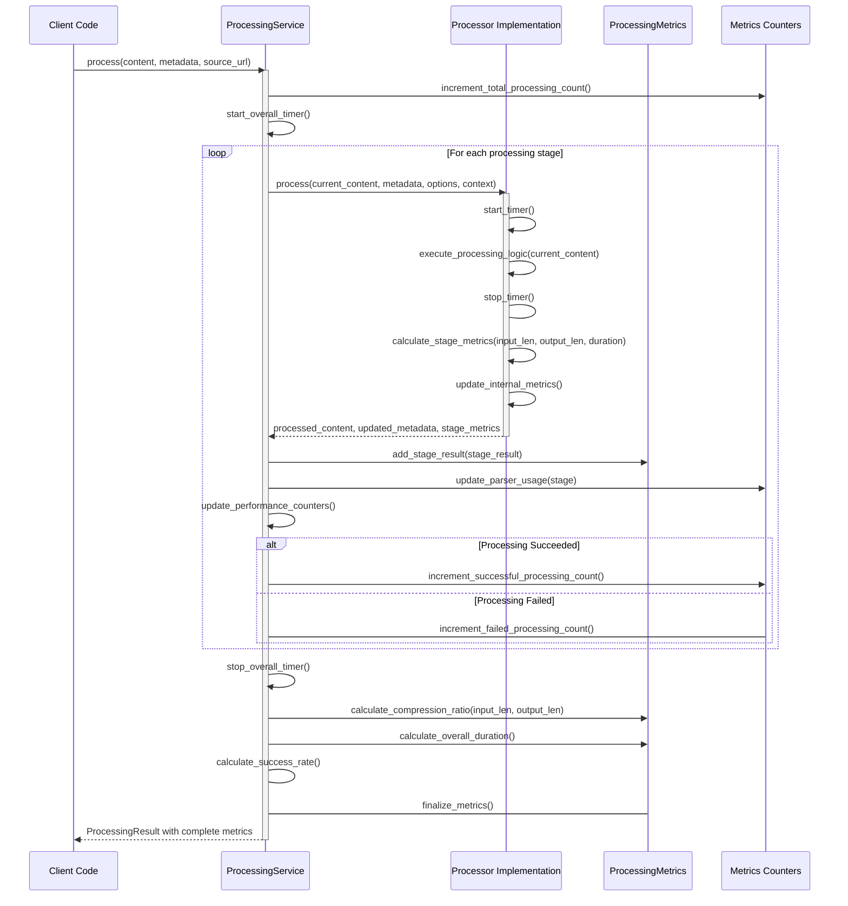
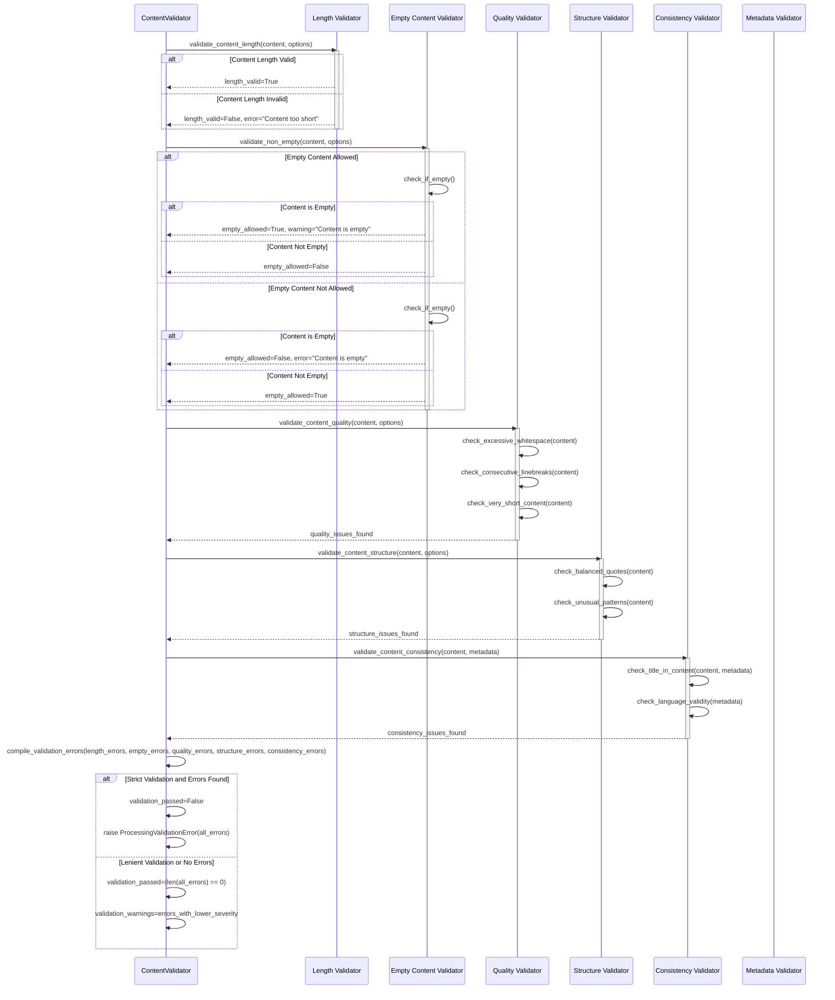
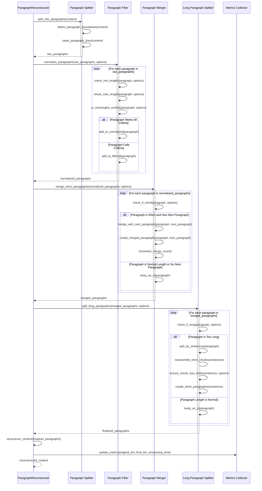
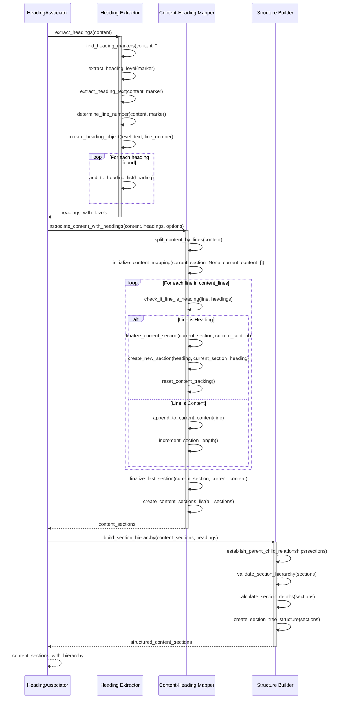
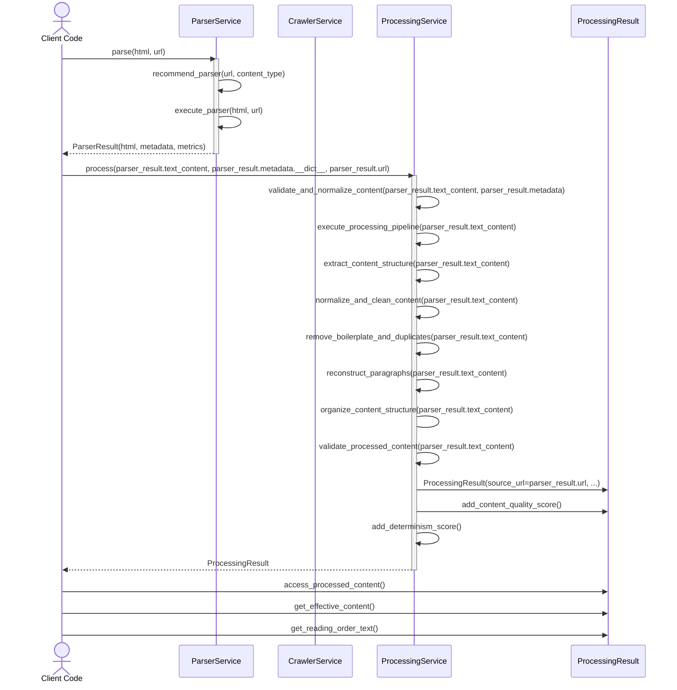

# Content Processor - Sequence Diagrams

## Overview

This document provides sequence diagrams showing the interaction flow between components in the Content Processor architecture.

## Main Processing Flow

### **Diagram: Complete Processing Pipeline**



### **Flow Description:**

1. **Client Request**: Client calls `ProcessingService.process()` with content
2. **Initialization**: Service initializes processing context and metrics
3. **Sequential Processing**: Each processor executes in pipeline order:
   - **Stage 1-3**: Normalization (whitespace, unicode, HTML entities)
   - **Stage 4-5**: Cleanup (boilerplate, navigation/footer)
   - **Stage 6-7**: Structure (duplicate detection, paragraph reconstruction)
   - **Stage 8-9**: Organization (heading association, reading order)
   - **Stage 10-11**: Finalization (metadata cleanup, validation)
4. **Result Assembly**: Service creates `ProcessingResult` with all processed data
5. **Metrics Collection**: Each stage contributes to overall metrics
6. **Quality Scoring**: Final quality and determinism scores calculated

---

## Processor Registration Flow

### **Diagram: Processor Registration**



### **Flow Description:**

1. **Service Initialization**: Default processors are registered
2. **Custom Implementation**: Developer creates custom processor
3. **Registration**: Custom processor registered in service
4. **Pipeline Extension**: Custom processor becomes part of pipeline
5. **Validation**: All stages available for processing

---

## Stage-Level Processing Flow

### **Diagram: Individual Processor Execution**



### **Flow Description:**

1. **Enablement Check**: Processor checks if enabled in options
2. **Skip Check**: Short-circuit for empty or too-large content
3. **Pre-Validation**: Validate content and configuration
4. **Execution**: Execute processing logic with timing
5. **Result Creation**: Create stage result with metrics
6. **Error Handling**: Handle validation errors based on strictness
7. **Context Updates**: Update processing context and metrics

---

## Error Handling Flow

### **Diagram: Error Handling and Recovery**



### **Flow Description:**

1. **Processing Attempt**: Try primary processor first
2. **Success Path**: Update metrics and continue to next stage
3. **Failure Path**: Log error and determine criticality
4. **Critical Errors**: Validation failures stop processing
5. **Recoverable Errors**: Processing failures allow continuation
6. **Metrics Collection**: Track success/failure rates
7. **Result Finalization**: Create final result with quality scores

---

## Metrics Collection Flow

### **Diagram: Processing Metrics Collection**



### **Flow Description:**

1. **Counter Initialization**: Increment total processing counter
2. **Timing**: Start overall processing timer
3. **Stage Processing**: Execute each stage with timing
4. **Stage Metrics**: Collect per-stage metrics
5. **Aggregation**: Aggregate metrics across all stages
6. **Counters**: Update success/failure counters
7. **Finalization**: Calculate overall metrics and ratios
8. **Result Creation**: Include complete metrics in final result

---

## Content Validation Flow

### **Diagram: Content Validation Process**



### **Flow Description:**

1. **Length Validation**: Check if content meets minimum length requirements
2. **Empty Content Validation**: Check if content is empty and if that's allowed
3. **Quality Validation**: Check for quality issues (whitespace, patterns)
4. **Structure Validation**: Check for structural issues (quotes, patterns)
5. **Consistency Validation**: Check content-metadata consistency
6. **Error Compilation**: Compile all validation errors and warnings
7. **Decision**: Based on strict validation settings, raise error or add warnings
8. **Result Update**: Update validation status in metadata

---

## Duplicate Detection Flow

### **Diagram: Duplicate Detection Process**

```mermaid
sequenceDiagram
    participant DD as DuplicateDetector
    participant SPLIT as Content Splitter
    participant COMP as Sequence Matcher
    participant METRICS as Metrics Collector

    DD->>SPLIT: split_into_paragraphs(content)
    activate SPLIT
    SPLIT->>SPLIT: detect_paragraph_boundaries(content)
    SPLIT->>SPLIT: extract_paragraphs(content)
    SPLIT-->>DD: paragraphs
    deactivate SPLIT

    DD->>DD: initialize_duplicate_tracking()
    DD->>DD: duplicate_count = 0

    loop For each paragraph i in paragraphs
        DD->>DD: check_minimum_length(paragraph[i], options)

        alt Paragraph Long Enough
            loop For each paragraph j in paragraphs[i+1:]
                DD->>DD: check_minimum_length(paragraph[j], options)

                alt Both Paragraphs Long Enough
                    DD->>COMP: calculate_similarity(paragraph[i], paragraph[j])
                    activate COMP
                    COMP->>COMP: SequenceMatcher(None, paragraph[i], paragraph[j]).ratio()
                    COMP-->>DD: similarity_score
                    deactivate COMP

                    alt Exact Match
                        DD->>DD: add_duplicate(i, j)
                        DD->>DD: increment_duplicate_count()
                    else Near-Duplicate Check
                        alt Similarity Threshold Exceeded
                            DD->>DD: add_duplicate(i, j)
                            DD->DD: increment_duplicate_count()
                        end
                    end
                end
            end
    end

    DD->>DD: collect_duplicate_indices(duplicates)
    DD->>DD: create_unique_paragraphs(paragraphs, duplicates)
    DD->>DD: reconstruct_content(unique_paragraphs)

    DD->>METRICS: update_metrics(duplicate_count, input_length, output_length)

    DD-->>DD: deduplicated_content, updated_metadata
```

### **Flow Description:**

1. **Content Splitting**: Split content into paragraphs
2. **Duplicate Tracking**: Initialize duplicate counter
3. **Pairwise Comparison**: Compare all paragraph pairs
4. **Similarity Calculation**: Use SequenceMatcher for near-duplicate detection
5. **Duplicate Detection**: Identify duplicates exceeding threshold
6. **Content Reconstruction**: Remove duplicates keeping first occurrence
7. **Metrics Update**: Track duplicate count and content reduction

---

## Paragraph Reconstruction Flow

### **Diagram: Paragraph Reconstruction Process**



### **Flow Description:**

1. **Paragraph Splitting**: Split content into paragraph units
2. **Normalization**: Filter paragraphs by length and quality criteria
3. **Short Paragraph Merging**: Merge adjacent short paragraphs
4. **Long Paragraph Splitting**: Split long paragraphs by sentences
5. **Content Reconstruction**: Reassemble normalized paragraphs
6. **Metrics Update**: Track paragraph count and content statistics

---

## Heading Association Flow

### **Diagram: Heading Association Process**



### **Flow Description:**

1. **Heading Extraction**: Find all headings with levels and positions
2. **Content Association**: Map content lines to nearest heading
3. **Section Creation**: Create sections for each heading with associated content
4. **Hierarchy Building**: Establish parent-child relationships between sections
5. **Structure Validation**: Ensure proper heading hierarchy (h1 before h2, etc.)
6. **Final Output**: Content sections with hierarchical structure

---

## Integration with Parser Module Flow

### **Diagram: Parser → Processor Integration**



### **Flow Description:**

1. **Parser Execution**: Parse HTML into structured content
2. **Content Validation**: Validate and normalize parsed content
3. **Pipeline Execution**: Execute all 11 processing stages
4. **Content Structure**: Extract and organize content structure
5. **Quality Enhancement**: Remove boilerplate, duplicates, normalize
6. **Organization**: Reconstruct paragraphs, headings, reading order
7. **Validation**: Final quality and consistency checks
8. **Result Creation**: Create comprehensive processing result
9. **Quality Scoring**: Calculate content quality and determinism scores
10. **Access Methods**: Provide methods to access processed content

---

## Summary

These sequence diagrams illustrate the complete flow of operations within the Content Processor architecture:

- **Main Processing Flow**: Complete pipeline with all 11 stages
- **Processor Registration**: Dynamic processor registration and validation
- **Stage-Level Processing**: Detailed individual processor execution with validation
- **Error Handling**: Robust error handling and recovery mechanisms
- **Metrics Collection**: Performance tracking and analysis
- **Content Validation**: Comprehensive validation process
- **Duplicate Detection**: Detailed duplicate detection algorithm
- **Paragraph Reconstruction**: Paragraph normalization process
- **Heading Association**: Content-to-heading mapping and structure building
- **Parser Integration**: Integration with parser module for end-to-end processing

These diagrams provide developers with a clear understanding of how components interact and data flows through the content processing system.