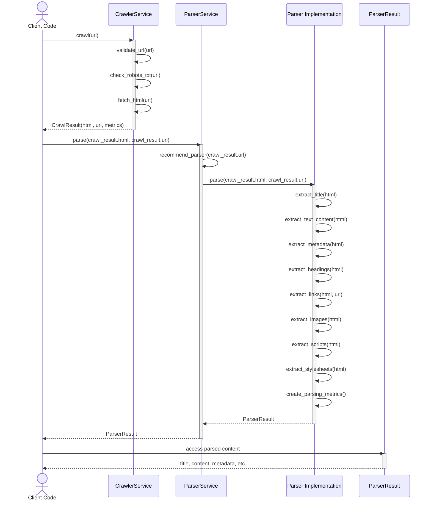
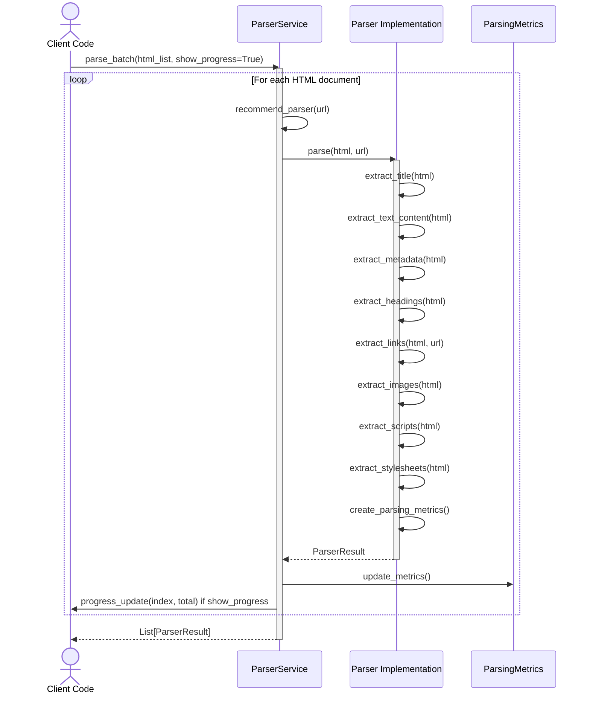
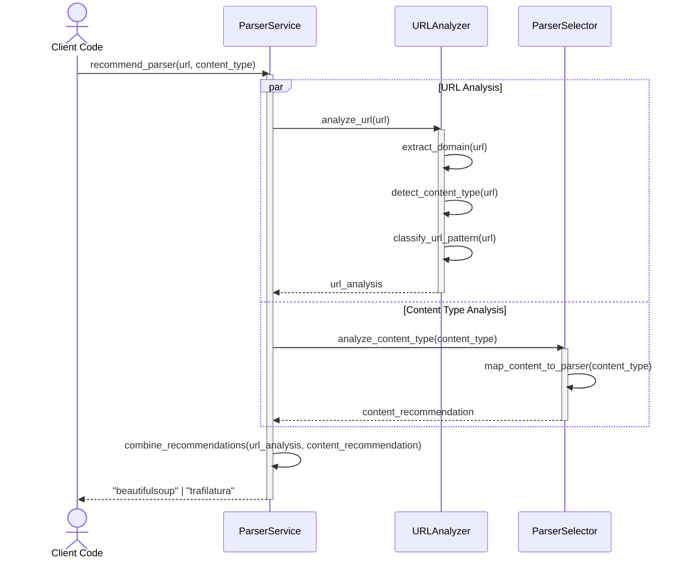
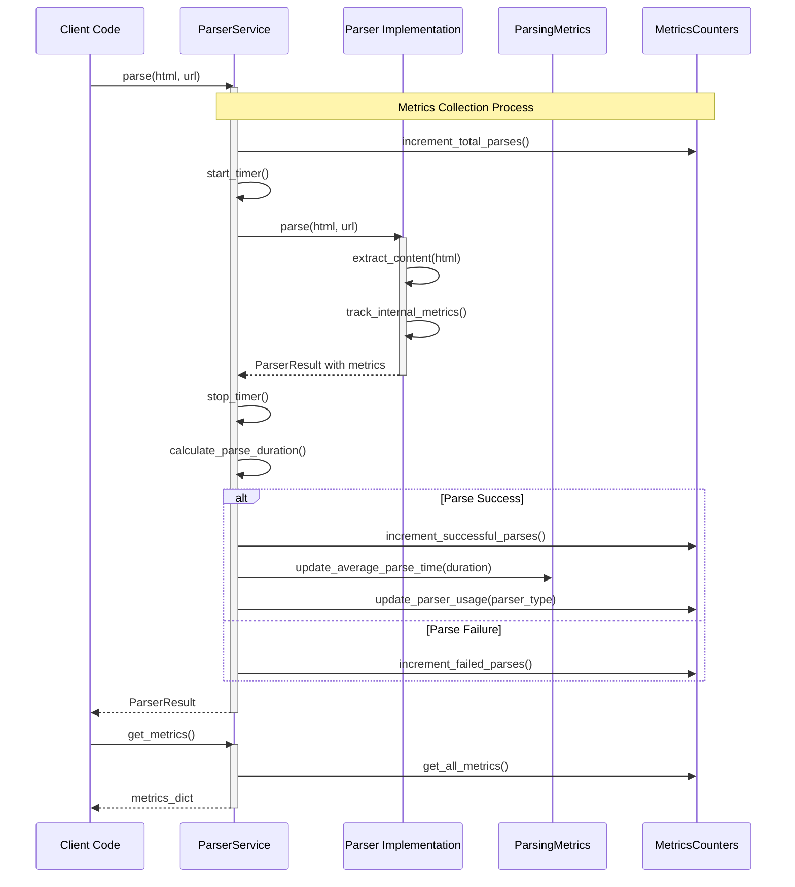
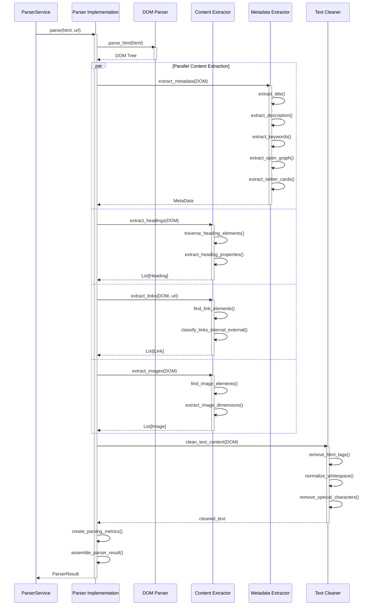
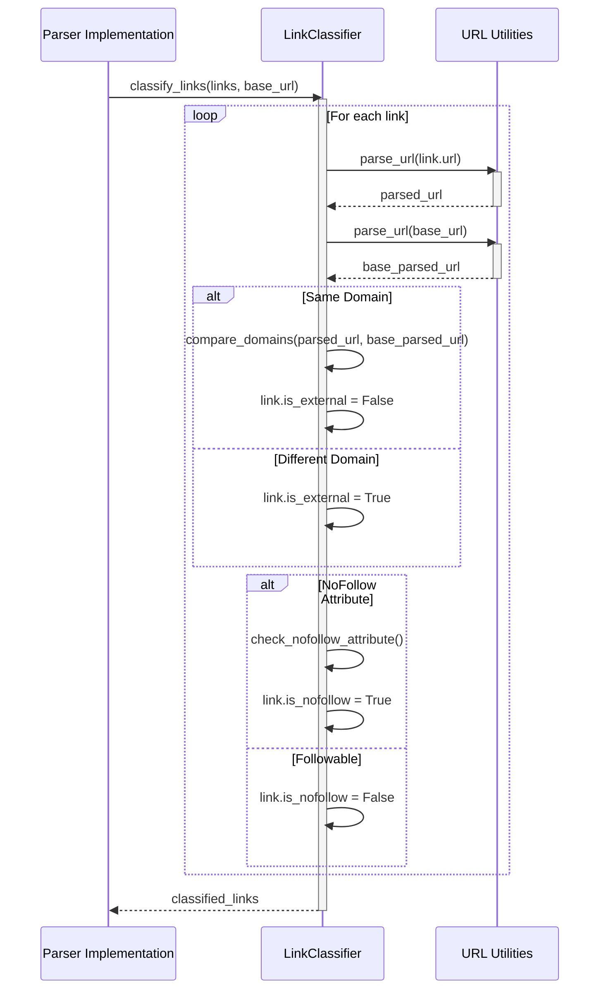
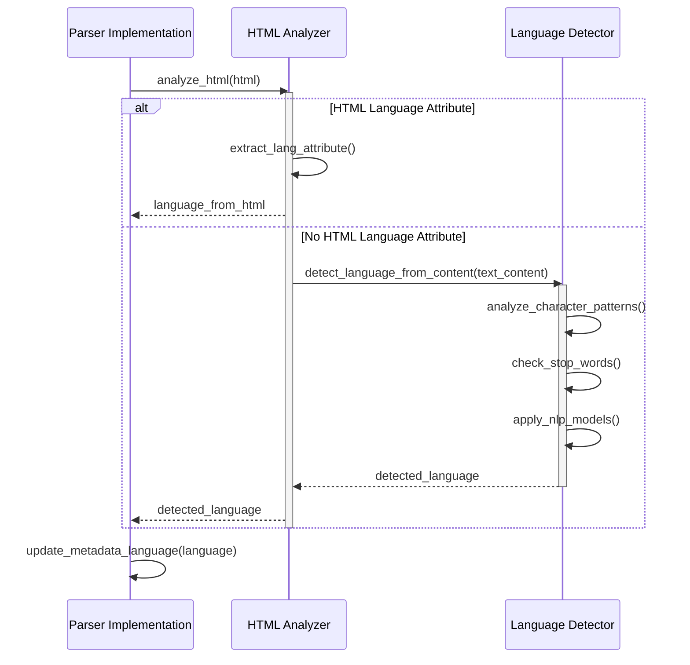
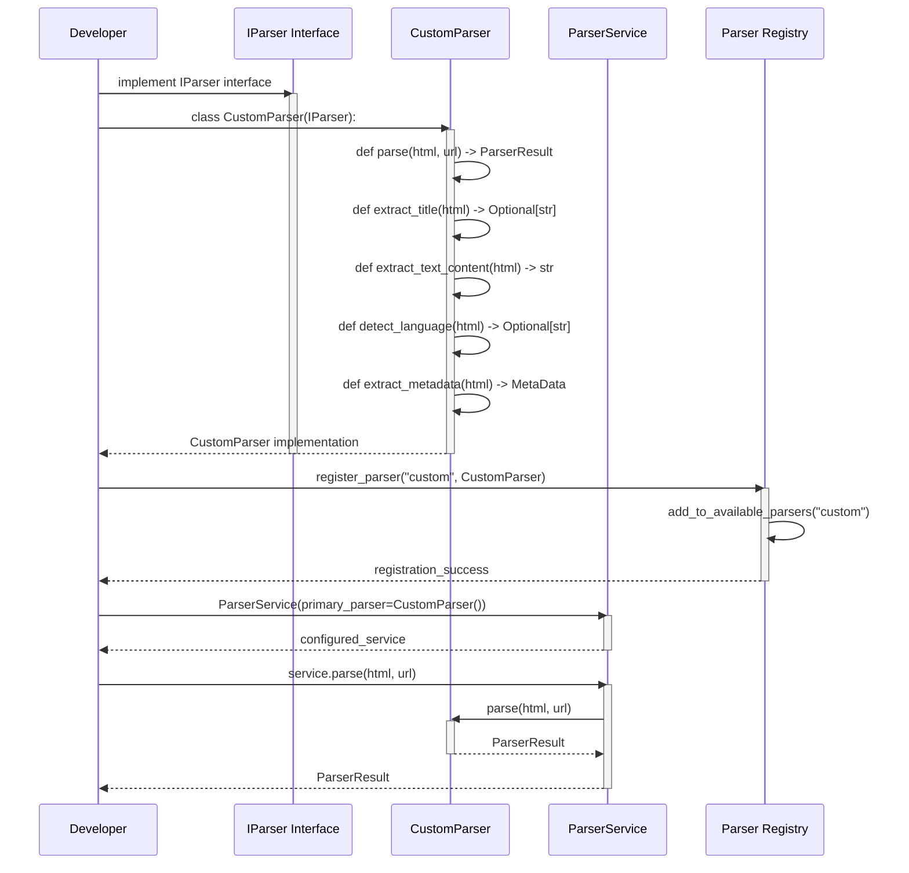
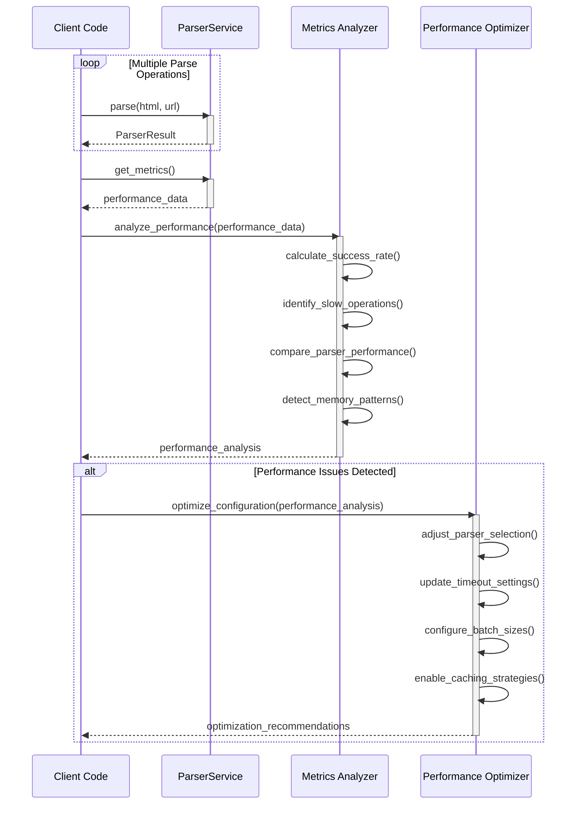

# Parser Module - Sequence Diagrams

## Overview

This document provides sequence diagrams showing the interaction flow between components in the Parser Foundation architecture.

## Main Parsing Flow

### **Diagram: Single Document Parsing**

```mermaid
sequenceDiagram
    actor Client as Client Code
    participant PS as ParserService
    participant BSOUP as BeautifulSoupParser
    participant TRAF as TrafilaturaParser
    participant RESULT as ParserResult

    Client->>PS: parse(html, url)
    activate PS

    PS->>PS: recommend_parser(url, content_type)
    PS-->>PS: selected_parser = "beautifulsoup"

    alt Primary Parser Success
        PS->>BSOUP: parse(html, url)
        activate BSOUP

        BSOUP->>BSOUP: extract_title(html)
        BSOUP->>BSOUP: extract_text_content(html)
        BSOUP->>BSOUP: detect_language(html)
        BSOUP->>BSOUP: extract_metadata(html)
        BSOUP->>BSOUP: extract_headings(html)
        BSOUP->>BSOUP: extract_links(html, url)
        BSOUP->>BSOUP: extract_images(html)
        BSOUP->>BSOUP: extract_scripts(html)
        BSOUP->>BSOUP: extract_stylesheets(html)
        BSOUP->>BSOUP: create_parsing_metrics()

        BSOUP-->>PS: ParserResult
        deactivate BSOUP

        PS-->>Client: ParserResult
        deactivate PS

    else Primary Parser Failure
        PS->>BSOUP: parse(html, url)
        activate BSOUP
        BSOUP-->>PS: ParserError
        deactivate BSOUP

        alt Fallback Enabled
            PS->>TRAF: parse(html, url)
            activate TRAF

            TRAF->>TRAF: extract_title(html)
            TRAF->>TRAF: extract_text_content(html)
            TRAF->>TRAF: detect_language(html)
            TRAF->>TRAF: extract_metadata(html)
            TRAF->>TRAF: extract_headings(html)
            TRAF->>TRAF: create_parsing_metrics()

            TRAF-->>PS: ParserResult
            deactivate TRAF

            PS-->>Client: ParserResult
            deactivate PS
        else Fallback Disabled
            PS-->>Client: ParserError
            deactivate PS
        end
    end
```

### **Flow Description:**

1. **Client Request**: Client code calls `ParserService.parse()` with HTML content and optional URL
2. **Parser Selection**: Service analyzes URL/content and selects appropriate parser
3. **Primary Parsing**: Primary parser executes all extraction methods
4. **Success Path**: If primary succeeds, `ParserResult` is returned to client
5. **Fallback Path**: If primary fails and fallback is enabled, secondary parser attempts parsing
6. **Error Handling**: If all parsers fail or fallback is disabled, error is returned to client

---

## Crawler Integration Flow

### **Diagram: Crawler → Parser Integration**



### **Flow Description:**

1. **Crawling Phase**:
   - Client requests URL crawling
   - CrawlerService validates URL, checks robots.txt, fetches HTML
   - Returns `CrawlResult` with HTML and metadata

2. **Parsing Phase**:
   - Client passes crawled HTML to ParserService
   - ParserService selects appropriate parser
   - Parser extracts all structured content
   - Returns `ParserResult` with comprehensive data

3. **Data Access**:
   - Client accesses parsed content through `ParserResult` properties
   - Can query specific content (links, images, headings, etc.)

---

## Batch Processing Flow

### **Diagram: Batch Document Parsing**



### **Flow Description:**

1. **Batch Request**: Client provides list of HTML documents
2. **Iterative Processing**: Service processes each document sequentially
3. **Progress Updates**: Optional progress reporting during processing
4. **Metrics Collection**: Each parse updates service-level metrics
5. **Result Return**: Returns list of `ParserResult` objects in same order as input

---

## Parser Selection Strategy Flow

### **Diagram: Parser Recommendation Logic**



### **Flow Description:**

1. **URL Analysis**: Analyzes URL domain, path patterns, and indicators
2. **Content Type Analysis**: Maps explicit content types to parser capabilities
3. **Recommendation Combining**: Combines analyses into final recommendation
4. **Parser Selection**: Returns recommended parser type

---

## Error Handling Flow

### **Diagram: Error Handling and Fallback**

```mermaid
sequenceDiagram
    actor Client as Client Code
    participant PS as ParserService
    participant PRIMARY as Primary Parser
    participant FALLBACK as Fallback Parser
    participant LOGGER as ErrorLogger

    Client->>PS: parse(html, url)
    activate PS

    PS->>PRIMARY: parse(html, url)
    activate PRIMARY

    alt Primary Parser Success
        PRIMARY-->>PS: ParserResult
        deactivate PRIMARY
        PS->>LOGGER: log_success(parser_used, metrics)
        PS-->>Client: ParserResult
    else Primary Parser Failure
        PRIMARY-->>PS: ParserError
        deactivate PRIMARY
        PS->>LOGGER: log_error(primary_parser, error)

        alt Fallback Enabled
            PS->>FALLBACK: parse(html, url)
            activate FALLBACK

            alt Fallback Parser Success
                FALLBACK-->>PS: ParserResult
                deactivate FALLBACK
                PS->>LOGGER: log_fallback_success(fallback_parser, metrics)
                PS-->>Client: ParserResult
            else Fallback Parser Failure
                FALLBACK-->>PS: ParserError
                deactivate FALLBACK
                PS->>LOGGER: log_complete_failure(primary_parser, fallback_parser)
                PS-->>Client: ParserError
            end
        else Fallback Disabled
            PS-->>Client: ParserError
        end
    end

    deactivate PS
```

### **Flow Description:**

1. **Primary Attempt**: Try primary parser first
2. **Success Path**: Log success and return result
3. **Failure Path**: Log error and attempt fallback if enabled
4. **Fallback Success**: Log fallback success and return result
5. **Complete Failure**: Log complete failure and return error
6. **No Fallback**: Return error immediately if fallback disabled

---

## Metrics Collection Flow

### **Diagram: Parsing Metrics Collection**



### **Flow Description:**

1. **Parse Initialization**: Increment total parse counter and start timer
2. **Parser Execution**: Parser executes and tracks internal metrics
3. **Parse Completion**: Stop timer and calculate duration
4. **Success Metrics**: Update success counters and average times
5. **Failure Metrics**: Update failure counters
6. **Metrics Retrieval**: Client can query metrics at any time

---

## Content Extraction Flow

### **Diagram: Detailed Content Extraction**



### **Flow Description:**

1. **DOM Parsing**: HTML is parsed into DOM tree
2. **Parallel Extraction**: Multiple extractions occur in parallel:
   - Metadata extraction (title, description, Open Graph, etc.)
   - Heading extraction (h1-h6 hierarchy)
   - Link extraction (with internal/external classification)
   - Image extraction (with dimensions)
3. **Text Cleaning**: Text content is cleaned and normalized
4. **Result Assembly**: All components combined into `ParserResult`

---

## Link Classification Flow

### **Diagram: Internal/External Link Classification**



### **Flow Description:**

1. **URL Parsing**: Both link URL and base URL are parsed
2. **Domain Comparison**: Domains are compared to determine internal/external
3. **NoFollow Check**: HTML attributes are checked for nofollow directive
4. **Classification**: Each link is marked as internal/external and nofollow/followable

---

## Language Detection Flow

### **Diagram: Content Language Detection**



### **Flow Description:**

1. **HTML Analysis**: Check for HTML lang attribute first
2. **Language Detection**: If no HTML language, use content analysis
3. **NLP Methods**: Apply character patterns, stop words, and ML models
4. **Language Update**: Update metadata with detected language

---

## Custom Parser Integration Flow

### **Diagram: Adding New Parser Implementation**



### **Flow Description:**

1. **Interface Implementation**: Developer creates class implementing `IParser`
2. **Method Implementation**: All abstract methods are implemented
3. **Parser Registration**: New parser is registered in system
4. **Service Configuration**: Service is configured with custom parser
5. **Normal Usage**: Custom parser works like built-in parsers

---

## Performance Optimization Flow

### **Diagram: Performance Metrics and Optimization**



### **Flow Description:**

1. **Normal Operation**: Service processes parse requests
2. **Metrics Collection**: Client collects performance metrics
3. **Performance Analysis**: Metrics are analyzed for patterns
4. **Optimization**: Recommendations made for configuration improvements

---

## Summary

These sequence diagrams illustrate the complete flow of operations within the Parser Foundation architecture:

- **Main Parsing Flow**: Core parsing operation with fallback
- **Crawler Integration**: How parser works with crawler module
- **Batch Processing**: Handling multiple documents efficiently
- **Parser Selection**: How appropriate parser is chosen
- **Error Handling**: Robust error handling and fallback mechanisms
- **Metrics Collection**: Performance tracking and analysis
- **Content Extraction**: Detailed content extraction process
- **Link Classification**: Internal/external link determination
- **Language Detection**: Content language identification
- **Custom Integration**: Adding new parser implementations
- **Performance Optimization**: Metrics-based optimization

These diagrams provide developers with a clear understanding of how components interact and data flows through the system.